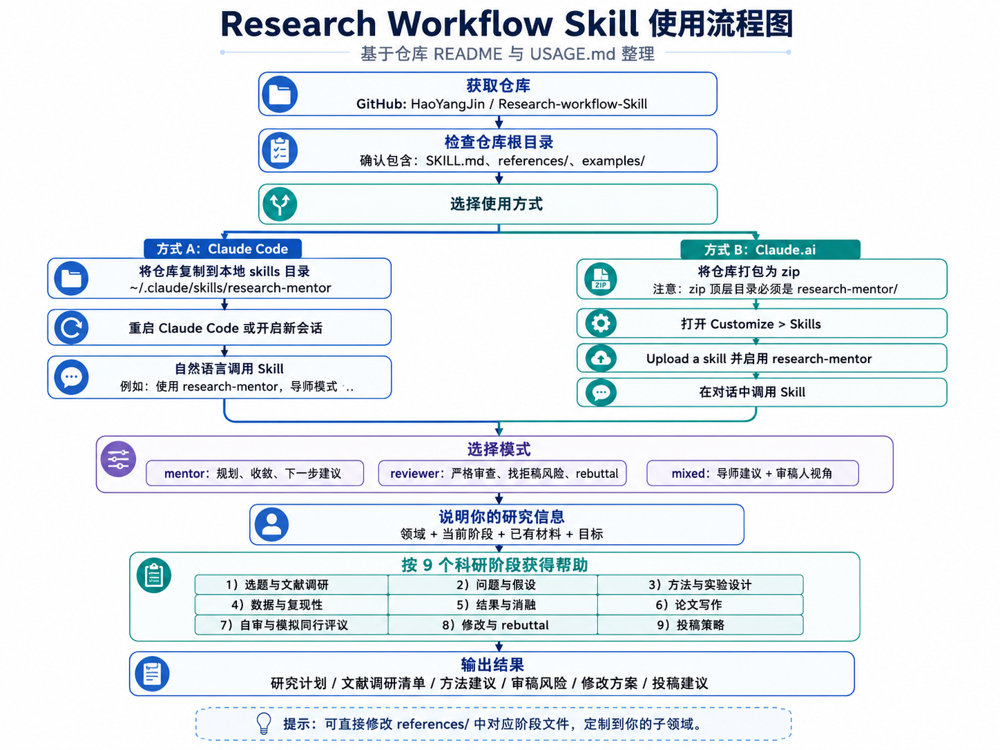
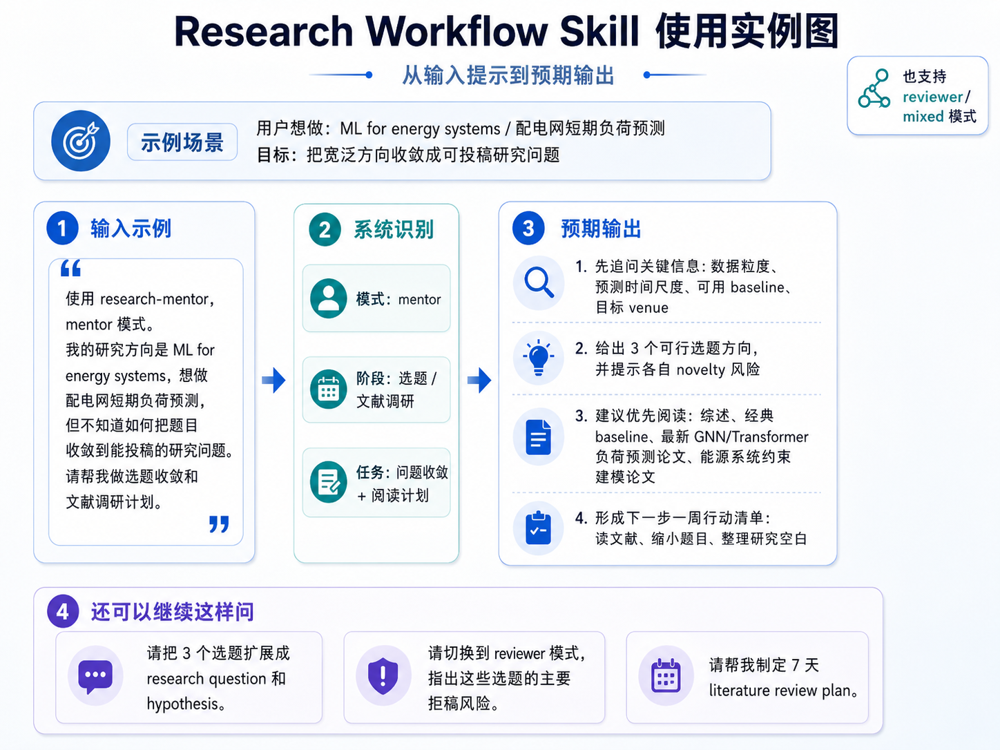

# Research Workflow Skill

[](LICENSE)
[](SKILL.md)
[](CHANGELOG.md)

一个面向学术研究全生命周期的开源 Skill：让 Claude 像资深导师一样提出问题、给出路径，也能像严格同行评审一样审稿、挑错、逼近薄弱环节。

This is an open-source research workflow Skill for the full academic lifecycle. It helps Claude act as a senior research mentor and a critical peer reviewer.

> 本 README 合并并扩展了仓库原始愿景：覆盖科研环境搭建、课题初始化、文献调研、技术方案设计、实验与数据处理、论文写作、投稿与修回等完整科研流程。

## Table of Contents

- [中文说明](#中文说明)
  - [使用图示](#使用图示)
  - [适用场景](#适用场景)
  - [快速开始](#快速开始)
  - [How It Works: 9 个科研阶段](#how-it-works-9-个科研阶段)
  - [示例](#示例)
- [English](#english)
  - [Visual Guide](#visual-guide)
  - [Use Cases](#use-cases)
  - [Quick Start](#quick-start)
  - [How It Works: 9 Research Phases](#how-it-works-9-research-phases)
  - [Example](#example)
- [Repository Structure](#repository-structure)
- [Contributing](#contributing)
- [License](#license)

## 中文说明

### 使用图示

下面两张图帮助你快速理解 `research-mentor` 的安装路径、模式选择和一次典型输入到输出的过程。





### 适用场景

使用 `research-mentor` 帮你完成：

- 选题、缩小研究范围、制定文献调研计划。
- 形成研究问题、假设、贡献点和可验证命题。
- 设计方法、实验、数据流程、复现方案和消融实验。
- 起草或审阅摘要、引言、相关工作、方法、结果、讨论。
- 进行自审、模拟同行评议、修改论文和回应 reviewer comments。
- 选择投稿 venue、制定投稿节奏和风险预案。

### 快速开始

1. 确认仓库根目录包含 `SKILL.md`。
2. 将整个仓库文件夹作为一个 Skill 文件夹使用，或按 [USAGE.md](USAGE.md) 生成带 `research-mentor/` 顶层目录的 zip 后上传到 Claude.ai。
3. 在对话中直接说明阶段和模式，例如：

```text
使用 research-mentor，mentor 模式。我的方向是基于图神经网络的配电网负荷预测，请帮我做选题收敛和文献调研计划。
```

更多安装、调用、模式切换和定制细节见 [USAGE.md](USAGE.md)。

### How It Works: 9 个科研阶段

1. **Topic scoping & literature review / 选题与文献调研**：从兴趣域收敛到可研究问题，建立文献地图。
2. **Research question & hypothesis formulation / 问题与假设**：把动机转化为可检验研究问题和假设。
3. **Methodology and experimental design / 方法与实验设计**：选择方法、基线、实验矩阵和评价指标。
4. **Data collection, analysis, and reproducibility / 数据与复现性**：检查数据来源、处理链路、可复现性和泄漏风险。
5. **Results interpretation and ablation thinking / 结果分析与消融**：解释结果、设计消融、识别过度结论。
6. **Paper drafting / 论文写作**：分章节打磨 abstract、intro、related work、methods、results、discussion。
7. **Self-review and simulated peer review / 自审与模拟同行评议**：用 reviewer 标准提前发现拒稿风险。
8. **Revision and rebuttal / 修改与 rebuttal**：制定修改计划并回应审稿意见。
9. **Submission strategy and venue selection / 投稿策略**：匹配期刊/会议、范围、贡献、周期和风险。

每个阶段都有对应的 `references/` 文件，包含 checklist、mentor prompts 和 reviewer red flags。

### 示例

```text
输入：
导师模式。我的研究方向是 ML for energy systems，想做配电网短期负荷预测，但不知道如何把题目收敛到能投稿的研究问题。

预期输出：
- 先追问数据粒度、预测时间尺度、可用 baseline、目标 venue。
- 给出 3 个可行选题方向，并指出每个方向的 novelty 风险。
- 建议优先阅读综述、经典 baseline、最新 GNN/Transformer 负荷预测论文和能源系统约束建模论文。
- 给出下一步一周文献调研清单。
```

## English

### Visual Guide

The following diagrams give users a quick overview of the installation paths, mode selection, and a typical input-to-output workflow.


### Use Cases

Use `research-mentor` when you want Claude to help you:

- Scope a research topic and plan a literature review.
- Form research questions, hypotheses, and claims.
- Design methods, experiments, baselines, metrics, and ablations.
- Audit data collection, analysis, and reproducibility.
- Draft or review academic paper sections.
- Run a simulated peer review before submission.
- Revise a paper and write rebuttals to reviewers.
- Choose a submission venue and publication strategy.

### Quick Start

1. Make sure the repository root contains `SKILL.md`.
2. Use the full folder as a Skill folder, or create a zip with a top-level `research-mentor/` directory as shown in [USAGE.md](USAGE.md).
3. Ask for a phase and a mode:

```text
Use research-mentor in reviewer mode. Please critique this methodology section and identify the strongest rejection risks.
```

See [USAGE.md](USAGE.md) for installation, invocation, mode switching, and customization details.

### How It Works: 9 Research Phases

1. Topic scoping & literature review.
2. Research question & hypothesis formulation.
3. Methodology and experimental design.
4. Data collection, analysis, and reproducibility.
5. Results interpretation and ablation thinking.
6. Paper drafting: abstract, introduction, related work, methods, results, discussion.
7. Self-review and simulated peer review.
8. Revision and rebuttal to reviewers.
9. Submission strategy and venue selection.

Each phase has a focused reference file under `references/` with checklists, mentor prompts, and reviewer-style red flags.

### Example

```text
Input:
Use research-mentor in mentor mode. I am studying ML for energy systems and want to build a publishable project around distribution-grid load forecasting.

Expected response:
- Clarify the forecasting horizon, data granularity, available baselines, and target venue.
- Propose several narrowed research directions.
- Flag novelty and evaluation risks early.
- Recommend a staged literature-review plan.
```

## Repository Structure

```text
.
├── SKILL.md
├── USAGE.md
├── README.md
├── references/
├── examples/
├── assets/
│   └── readme/
├── CONTRIBUTING.md
├── CODE_OF_CONDUCT.md
├── CHANGELOG.md
├── LICENSE
└── .gitignore
```

## Contributing

Issues and pull requests are welcome. Please read [CONTRIBUTING.md](CONTRIBUTING.md) and keep the core Skill domain-agnostic unless a subfield example is clearly labeled as optional.

## License

MIT © 2026 JinhAo Yang. See [LICENSE](LICENSE).
